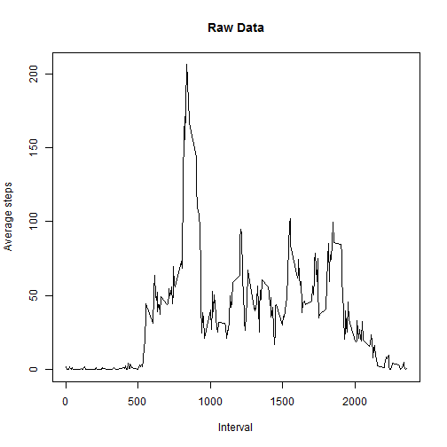

## 1. Loading and preprocessing the data
  
### 1.1 Loading the data  
  

```r
raw.df <- read.csv(unz(description = "activity.zip", filename = "activity.csv"))
```
  
### 1.2 Process/transform the data  
  
```
Data is good as-is.  
No preprocessing is needed.  
Skipping. 
```
  
## 2. What is mean total number of steps taken per day?
  
### 2.1 Calculate the total number of steps taken per day
  

```r
sd2.df <- raw.df %>% 
    filter(!is.na(steps)) %>% 
    group_by(date) %>% 
    select(steps) %>% 
    summarize(steps = sum(steps))
```
  
### 2.2 Histogram of the total number of steps taken each day  
  

```r
hist(sd2.df$steps, main = "Raw data", xlab = "Steps taken each day")
```

 
  
### 2.3 Mean and median of the total numbers of steps taken each day  
  
- Mean: 10766.19  
- Median: 10765.00  
  
## 3. What is the average daily activity pattern?
  
### 3.1 Make a time series plot (i.e. type = "l") of the 5-minute interval (x-axis) and the average number of steps taken, averaged across all days (y-axis)  
  

```r
tmp.df <- raw.df %>% 
    filter(!is.na(steps)) %>% 
    group_by(interval) %>% 
    select(steps) %>% 
    summarize(steps = mean(steps))

plot(tmp.df$steps ~ tmp.df$interval, type = "l", ylab = "Average steps", xlab = "Interval", main = "Raw Data")
```

 
  
### 3.2 Which 5-minute interval, on average across all the days in the dataset, contains the maximum number of steps?  
  

  
The 5-minute interval containing the maximum number of steps on average across all days in the dataset is interval 835.  
The (averaged) maximum is  206.1698113.   
  
## 4. Imputing missing values
  
### 4.1 Calculate and report the total number of missing values in the dataset (i.e. total number of rows with NAs)  
  

  
The total number of missing values in the data set is 2304  
  
### 4.2 Devise a strategy for filling in all of the missing values in the dataset. The strategy does not need to be sophisticated. For example, you could use the mean/median for that day, or the mean for that 5-minute interval, etc.  
  

```r
# My strategy will be to replace NAs with the median for that 5-minute interval
tmp.df <- raw.df %>% 
    filter(!is.na(steps)) %>% 
    group_by(interval) %>% 
    select(steps) %>% 
    summarize(steps = median(steps))
```
  
### 4.3 Create a new dataset that is equal to the original dataset but with the missing data filled in.  
  

```r
imp.df <- ddply(
    raw.df, 
    c("date", "interval"), 
    transform, 
    steps = ifelse(is.na(steps), tmp.df$steps[tmp.df$interval == interval], steps)
    )
```
  
### 4.4 Make a histogram of the total number of steps taken each day and Calculate and report the mean and median total number of steps taken per day. Do these values differ from the estimates from the first part of the assignment? What is the impact of imputing missing data on the estimates of the total daily number of steps?  
  

```r
sd4.df <- imp.df %>% 
    group_by(date) %>% 
    select(steps) %>% 
    summarize(steps = sum(steps))

hist(sd4.df$steps, main = "Imputed data", xlab = "Steps taken each day")
```

 
  
- Mean: 9503.87, (originally 10766.19)  
- Median: 10395.00, (originally 10765.00)  
  
```
Both the mean and median for the data set went down by quite a bit.  
This is a consequence of the imputing method.  
The median number of steps is zero or low for most intervals.  
Replacing the NAs with the median number of steps for the interval, pushes down the dataset mean and median.  
```
  
## 5. Are there differences in activity patterns between weekdays and weekends?
  
### 5.1 Create a new factor variable in the dataset with two levels - "weekday" and "weekend" indicating whether a given
date is a weekday or weekend day.  

```r
as.dowclass <- function(x) {
    as.factor(ifelse(weekdays(as.Date(x), abbreviate = TRUE) %in% c("Sat", "Sun"), "Weekend", "Weekday"))
}

imp.df <- imp.df %>% 
    mutate(dowclass = as.dowclass(date))
```
  
### 5.2 Make a panel plot containing a time series plot (i.e. type = "l") of the 5-minute interval (x-axis) and the average number of steps taken, averaged across all weekday days or weekend days (y-axis). See the README file in the GitHub repository to see an example of what this plot should look like using simulated data.  
  

```r
tmp.df <- imp.df %>% 
    group_by(interval, dowclass) %>% 
    select(steps, interval, dowclass) %>% 
    summarize(steps = mean(steps))

ggplot(data = tmp.df, aes(x = interval, y = steps)) +
    geom_line() +
    facet_wrap(~dowclass) +
    xlab("Interval") + 
    ylab("Average Steps") + 
    ggtitle("Imputed Data")
```

 
  
```
The overall activity pattern is about the same.  
Subjects tends to be more active around mid-morning both in weekdays and weekends.  
There is a slight difference in the activity pattern, though:   
On weekdays, subjects are slightly more active between 7:30 and 10:00 A.M.  
On weekends, subjects have three slight peaks of activity at mid-morning, noon, and mid-afternoon.
```
